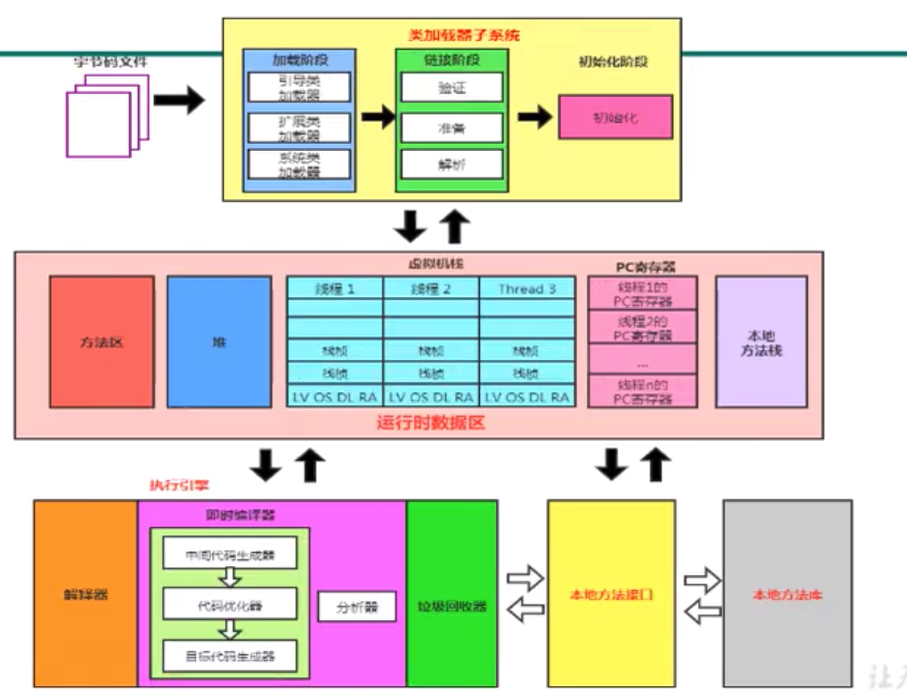
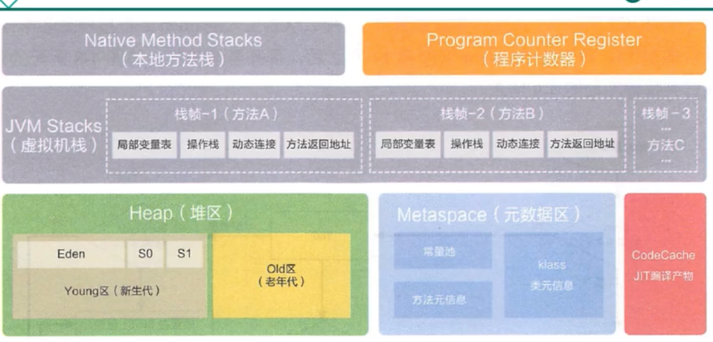

# jvm

* [JVM参数设置、分析](https://www.cnblogs.com/redcreen/archive/2011/05/04/2037057.html)

## 1. java虚拟机介绍

1. 执行java字节码
2. 一次编译到处运行
3. 自动内存管理垃圾回收

### 1.1 架构模型

1. 基于栈的
2. 基于寄存器的

基于栈的优点，跨平台性，指令集小，指令多，但是执行性能比寄存器差

javap -v class文件 可以看字节码

### 1.2 jvm生命周期

1. 虚拟机启动 启动通过引导类加载器 bootstrap class loader 创建初始类
2. 虚拟机执行 java程序执行的时候会有一个java虚拟机进程
3. 虚拟机退出 正常结束，异常，System.exit()

### 1.3 jvm发展历程

1. 1996 Sun Classic VM 只提供解释器
2. JDK1.2 Exact Memory VM 能知道内存中某个位置的数据类型，热点探测，编译器与解释器混合使用
3. HotSpot JDK1.3 jvm默认虚拟机 jdk8 引入元空间 之前叫方法区 
4. BEA公司 JRocket 针对服务端 
5. IBM J9
6. Oracle javaME CDC/CLDC
7. Azul VM 高性能 指定平台
8. Apache Harmony
9. Microsoft VM
10. TaoBao JVM 对intel cpu耦合
11. Dalvik VM 支持提前编译
12. Graal VM 跨语言全栈虚拟机 

#### 1.3.1 HotSpot热点探测技术

1. 通过计数器找到最具编译价值的代码，触发即时编译或者栈上替换
2. 通过编译器与解释器协同工作，在最优化程序响应时间和执行性能取得平衡

## 2. 内存结构概述

### 2.1 类加载过程

#### 2.1.1 类加载器

ClassLoader

#### 2.1.2 类加载过程

##### 1. 加载

1. 通过一个类的全限定名，获取定义此类的二进制字节流
2. 将这个字节流所代表的静态存储结构转化为方法区的运行时数据结构
3. 在内存中生成一个代表这个类的java.lang.Class对象，作为方法区各种数据的这个类的访问入口

加载class文件的方式

1. 本地系统获取
2. 网络获取
3. zip压缩包，jar包，war包
4. 运行时计算生成 动态代理
5. 其他文件生成 JSP
6. 数据库
7. 加密文件，防止反编译

##### 2. 链接

###### 2.1 验证

确保class文件安全性，不会导致虚拟机崩溃

###### 2.2 准备

* 为类变量分配内存，并且设置该类变量的默认初始值，即0值
* 这里不包含用final修饰的static，因为final在编译时就会分配了，准备阶段会显式初始化
* 这里不会包含实例变量分配的初始化，类变量会分配在方法区中，实例变量会随着对象一起分配到java堆中

###### 2.3 解析

* 将常量池内的 符号引用 转换为 直接引用的过程，
* 实际就是 把引用的类的符号转换为实际类的过程
* 方法 字段 类 的符号引用变为常量池地址引用

##### 3. 初始化

* clinit 给static修饰变量或者代码块赋值，赋值按照代码顺序来的
* 子类静态变量货者代码块执行晚于父类的执行

#### 2.1.3 类加载器分类

* jvm分类两类加载器，引导类类加载器，自定义类加载器
* 其他类加载器简介继承ClassLoader类
* 系统的核心类库由引导类加载器加载

### 2.2 双亲委派机制

1. 如果一个类收到类加载请求，它并不会自己先去加载，而是把这个请求交给其父类加载
2. 如果类加载器还存在父类加载器，继续向上委托
3. 如果父类完成加载，就成功返回，如果无法完成加载任务就交给子类加载器加载

优点：避免类重复加载，保护java核心api防止被篡改

#### 2.2.1 沙箱安全机制

不允许自定义的类或者包名与java核心api重复或者有主函数

#### 2.2.3 两个class对象相等的条件

1. 类的完整类名必须一致，包括包名，同一class文件
2. 加载这个类的classloader必须相同

#### 2.2.4 类的主动使用和被动使用

1. 主动使用 
2. 被动使用

## 3. 运行时数据区

* 95%垃圾回收在堆区，5%在方法区
* RumTime对象是单例的

### 3.1 线程

* 在hotspot中每个线程与操作系统的本地线程一一对应，java线程执行终止后，本地线程也会回收
* 一旦线程本地初始化成功，就会调用java线程中的run()方法
* 守护线程，普通线程

### 3.2 程序计数器，（PC寄存器）

* PC寄存器用来存储指向下一条指令的地址，也即将要执行的指令代码，由执行引擎读取下一条指令
* 没有垃圾回收
* 不会发生OOM

### 3.3 虚拟机栈

* 栈是运行时单位，堆是存储单位
* java虚拟机栈，每个线程在创建的时候都会创建一个虚拟机栈，其内部保存着一个个的栈桢，对应着一次又一次的方法调用
* 生命周期和线程一致
* 主管java程序的运行，它保存方法的局部变量（八中基本类型，引用类型的地址），部分结果，并参与方法的调用和返回
* 栈是一种快速有效的分配存储方式，速度仅次于程序计数器
* 方法运行进栈，方法运行完出栈
* 不存在垃圾回收

#### 3.3.1 栈异常

* 如果采用固定大小的虚拟机栈，那每一个线程的java虚拟机栈容量可以在线程创建的时候独立选定，如果线程请求分配的栈容量超过java虚拟机栈允许的最大容量，
  会抛出StackOverFlowError异常
* 如果java虚拟机栈可以动态扩展，在扩展的时候无法申请足够的内存，会抛出OutOfMemoryError异常

#### 3.3.2 设置大小

* -Xss 命令设置大小

#### 3.3.3 栈的存储结构和运行原理

* 每个线程都有自己的栈，栈中的数据都是以栈桢的格式存在
* 在这个线程上面正在执行的每个方法都有一个栈桢
* 栈桢是一个内存区块，是一个数据集，维系着方法执行过程中的各种数据信息
* 操作只有入栈出栈
* 活动的线程上，一个时间点上，只会有一个栈桢
* return和抛出异常都会使栈桢出栈，try catch可以捕捉异常

##### 3.3.3.1 栈桢结构

* 局部变量表
* 操作数栈
* 动态链接 （或指向运行时常量池的方法引用）
* 方法返回地址 （方法正常或者异常退出的定义）

###### 1. 局部变量表

* 定义一个数字数组，用于存储方法参数和定义在方法体内的局部变量
* 不存在数据安全问题
* 局部变量表所需的容量大小是在编译期确定下来
* 方法嵌套的次数由栈的大小决定
* 局部变量表中的变量只在当前方法中有效，随着栈桢销毁，局部变量表销毁

###### 2. 最基础的存储单位叫做变量槽，slot

* 32位占一个变量槽，64位占两个变量槽long和double类型
* 引用类型和其他基础类型占一个slot
* 如果需要访问局部变量表中的一个64bit的局部变量值时，只需要使用前一个索引就行了
* 如果当前栈桢是由构造方法或者实例方法创建的，那么this方法会放在index为0的slot处其余参数按照参数表顺序排列

###### 3. 成员变量和局部变量

* 成员变量
  - 类变量 在 linking和prepare阶段给类变量默认赋值
  - 成员变量 在类初始化时赋值
* 局部变量
  - 必须显示赋值
  
###### 4. 操作数栈

* 使用数组实现
* 操作数栈，在方法执行过程中，根据字节码指令，往栈中写入数据或提取数据，即入栈push/出栈pop
* 主要用于保存计算的中间结果，同时作为计算过程中变量的临时存储空间
* 只能通过入栈和出栈访问数据

栈顶缓存技术，将栈顶元素存储到cpu寄存器中，减少内存读取，提高效率

###### 5. 动态链接

* 每一个栈桢内部都包含一个指向运行时常量池中该栈桢所属方法的引用。包含这个引用的目的就是为了支持当前方法的代码能够实现动态链接
* 符号引用指向运行时常量池调用方法的直接引用

###### 6. 方法的绑定机制，静态绑定和动态绑定

* 静态链接 在编译期间确定下来的符号引用关系，运行期保持不变 早期绑定
* 动态链接 在运行期间确定的符号绑定关系 晚期绑定
* 非虚方法 编译器就确定了具体的调用版本，这个版本在运行时是不可变的 静态方法，私有方法，final方法 实例构造器，父类方法都是非虚方法
* 其他方法为非虚方法

* invokestatic 静态方法
* invokespecial 私有 父类方法
* invokevirtual final 子类非私有方法
* invokeinterface 接口方法

* invokedynamic 动态解析出想要调用的方法 lambda表达式引入表示java拥有动态语言特性
* 静态类型语言在编译器检查类型，检查变量类型 动态类型语言在运行时检查动态类型语言，检查变量值类型

###### 7. 方法重写的本质与虚方法表的使用

* 找到操作数栈顶的第一个元素所执行的对象的实际类型，记作 C
* 如果类型C在常量池中找到符合简单名称都相符的方法，则进行权限校验，通过则返回这个方法的直接引用
* 否则按照继承关系找父类的这个方法

* 在面向对象编程中，会很频繁使用动态分派，为了提高性能，jvm在类的方法区建立虚方法表
* 在类加载 链接-解析 阶段创建

###### 8. 方法返回地址

* 方法退出之后会回到该方法的调用位置
* 正常退出，调用者的pc计数器的值作为返回地址，即调用该方法的指令的下一条指令的地址
* 异常退出，返回地址通过异常表来确定，不会给调用者返回值

###### 8 一些附加信息

程序调试提供的支持信息
