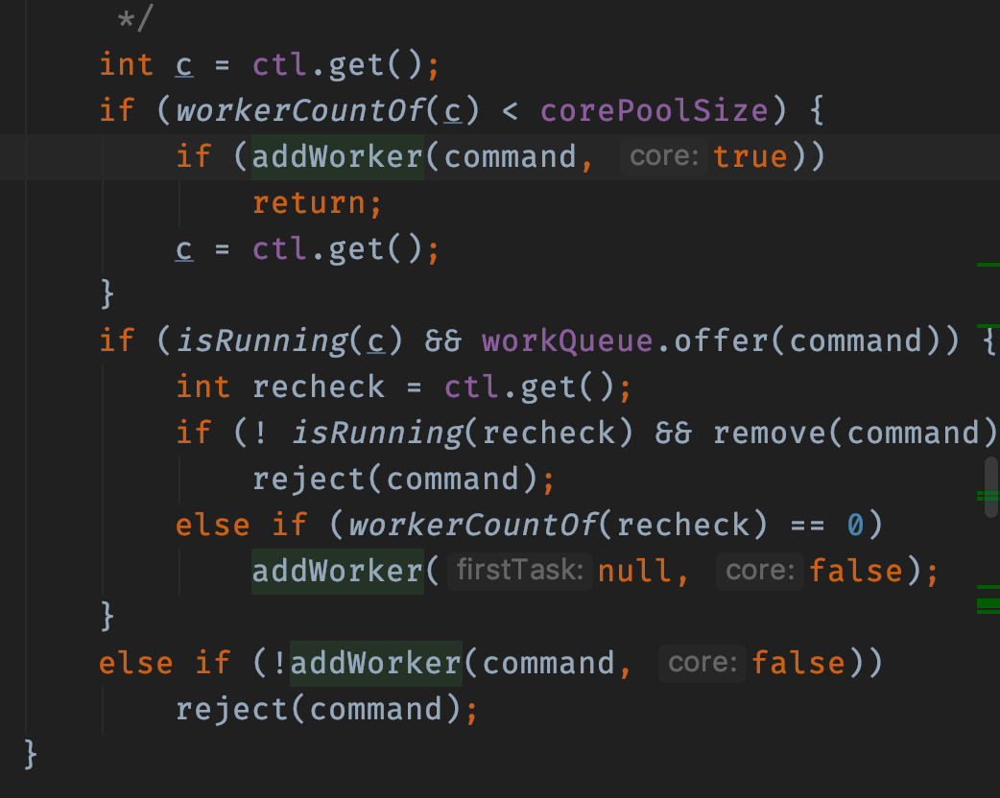
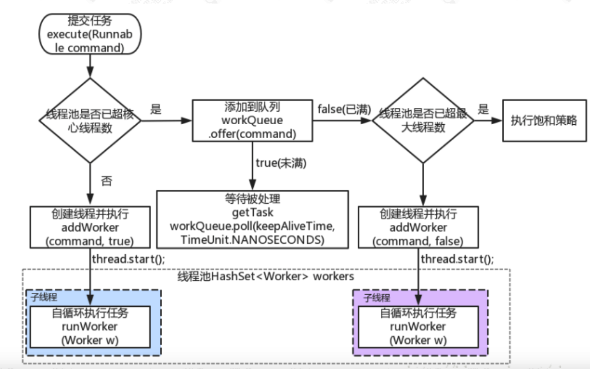

# 线程池

[ThreadPoolExecutor的addWorker方法](https://blog.csdn.net/u011637069/article/details/79593114)

[ThreadPoolExecutor源码解析](https://www.jianshu.com/p/a977ab6704d7)

## 线程池源码

### FutureTask 配合 Callable

callable实现

### submit和execute区别

1. submit有返回值 execute没有返回值
2. 

### ThreadPoolExecutor关系

java.util.concurrent.Executor 第一层执行接口execute
java.util.concurrent.ExecutorService 第二层提交接口 submit接口
java.util.concurrent.AbstractExecutorService 第三层 执行接口和提交接口整合
java.util.concurrent.ThreadPoolExecutor 具体实现

### ThreadPoolExecutor参数

1. int corePoolSize, 核心线程数
2. int maximumPoolSize, 最大线程数
3. long keepAliveTime, 存活时间
4. TimeUnit unit, 时间单位
5. BlockingQueue<Runnable> workQueue, 工作队列
6. ThreadFactory threadFactory, 线程工厂
7. RejectedExecutionHandler handler, 饱和策略

### ThreadPoolExecutor#execute 方法解析

execute->addWorker->new Worker(firstTask)->t.start()->run()->runWorker()->task.run()

Worker实现AQS和Runnable 实现run方法执行runWorker方法，task.run()执行真正的业务逻辑，
processWorkerExit方法退出->继续调用addWorker方法，达到线程池复用

### execute执行四种情况



1. 线程数量小于核心线程数，将work放入核心数量里面
2. 线程数量大于核心线程数，将work放入workQueue
3. 不满足前两种，创建非核心线程执行，失败之后执行拒绝策略



#### execute方法注释

```
public void execute(Runnable command) {
            if (command == null)
                throw new NullPointerException();
            int c = ctl.get();
            if (workerCountOf(c) < corePoolSize) {//1.当前池中线程比核心数少，新建一个线程执行任务
                if (addWorker(command, true))
                    return;
                c = ctl.get();
            }
            if (isRunning(c) && workQueue.offer(command)) {//2.核心池已满，但任务队列未满，添加到队列中
                int recheck = ctl.get();
                //任务成功添加到队列以后，再次检查是否需要添加新的线程，因为已存在的线程可能被销毁了
                if (! isRunning(recheck) && remove(command))
                    reject(command);//如果线程池处于非运行状态，并且把当前的任务从任务队列中移除成功，则拒绝该任务
                else if (workerCountOf(recheck) == 0)//如果之前的线程已被销毁完，新建一个线程
                addWorker(null, false);
            }
            else if (!addWorker(command, false)) //3.核心池已满，队列已满，试着创建一个新线程
                reject(command); //如果创建新线程失败了，说明线程池被关闭或者线程池完全满了，拒绝任务
        }
```

#### addWorker方法分析

如果工作线程数小于核心线程数的话，会调用 addWorker，顾名思义，其实就是要创建一个工作线程。我们来看看源码的实现
源码比较长，其实就做了两件事。

才用循环 CAS 操作来将线程数加 1；
新建一个线程并启用。

```java_holder_method_tree
private boolean addWorker(Runnable firstTask, boolean core) {
        retry: //goto 语句,避免死循环
        for (;;) {
            int c = ctl.get();
            int rs = runStateOf(c);
            // Check if queue empty only if necessary.
            /*如果线程处于非运行状态，并且 rs 不等于 SHUTDOWN 且 firstTask 不等于空且且
            workQueue 为空，直接返回 false（表示不可添加 work 状态）
            1. 线程池已经 shutdown 后，还要添加新的任务，拒绝
            2. （第二个判断）SHUTDOWN 状态不接受新任务，但仍然会执行已经加入任务队列的任
            务，所以当进入 SHUTDOWN 状态，而传进来的任务为空，并且任务队列不为空的时候，是允许添加
            新线程的,如果把这个条件取反，就表示不允许添加 worker*/
            if (rs >= SHUTDOWN &&
                    ! (rs == SHUTDOWN &&
                            firstTask == null &&
                            ! workQueue.isEmpty()))
                return false;
            for (;;) { //自旋
                int wc = workerCountOf(c);//获得 Worker 工作线程数
                //如果工作线程数大于默认容量大小或者大于核心线程数大小，则直接返回 false 表示不
                能再添加 worker。
                if (wc >= CAPACITY ||
                        wc >= (core ? corePoolSize : maximumPoolSize))
                    return false;
                if (compareAndIncrementWorkerCount(c))//通过 cas 来增加工作线程数，如果 cas 失败，则直接重试
                    break retry;
                c = ctl.get(); // Re-read ctl //再次获取 ctl 的值
                if (runStateOf(c) != rs) //这里如果不想等，说明线程的状态发生了变化，继续重试
                    continue retry;
                // else CAS failed due to workerCount change; retry inner loop
            }
        }

        
        //上面这段代码主要是对 worker 数量做原子+1 操作,下面的逻辑才是正式构建一个 worker


        boolean workerStarted = false; //工作线程是否启动的标识
        boolean workerAdded = false; //工作线程是否已经添加成功的标识
        Worker w = null;
        try {
            w = new Worker(firstTask); //构建一个 Worker，这个 worker 是什么呢？我们可以看到构造方法里面传入了一个 Runnable 对象
            final Thread t = w.thread; //从 worker 对象中取出线程
            if (t != null) {
                final ReentrantLock mainLock = this.mainLock;
                mainLock.lock(); //这里有个重入锁，避免并发问题
                try {
                    // Recheck while holding lock.
                    // Back out on ThreadFactory failure or if
                    // shut down before lock acquired.
                    int rs = runStateOf(ctl.get());
                    //只有当前线程池是正在运行状态，[或是 SHUTDOWN 且 firstTask 为空]，才能添加到 workers 集合中
                    if (rs < SHUTDOWN ||
                            (rs == SHUTDOWN && firstTask == null)) {
                        //任务刚封装到 work 里面，还没 start,你封装的线程就是 alive，几个意思？肯定是要抛异常出去的
                        if (t.isAlive()) // precheck that t is startable
                            throw new IllegalThreadStateException();
                        workers.add(w); //将新创建的 Worker 添加到 workers 集合中
                        int s = workers.size();
                        //如果集合中的工作线程数大于最大线程数，这个最大线程数表示线程池曾经出现过的最大线程数
                        if (s > largestPoolSize)
                            largestPoolSize = s; //更新线程池出现过的最大线程数
                        workerAdded = true;//表示工作线程创建成功了
                    }
                } finally {
                    mainLock.unlock(); //释放锁
                }
                if (workerAdded) {//如果 worker 添加成功
                    t.start();//启动线程
                    workerStarted = true;
                }
            }
        } finally {
            if (! workerStarted)
                addWorkerFailed(w); //如果添加失败，就需要做一件事，就是递减实际工作线程数(还记得我们最开始的时候增加了工作线程数吗)
        }
        return workerStarted;//返回结果
    }
```

#### runWorker 方法

前面已经了解了 ThreadPoolExecutor 的核心方法 addWorker，主要作用是增加工作线程，而 Worker 简单理解其实就是一个线程，里面重新了 run 方法，这块是线程池中执行任务的真正处理逻辑，也就是 runWorker 方法，这个方法主要做几件事

1. 如果 task 不为空,则开始执行 task
2. 如果 task 为空,则通过 getTask()再去取任务,并赋值给 task,如果取到的 Runnable 不为空,则执行该任务
3. 执行完毕后,通过 while 循环继续 getTask()取任务
4. 如果 getTask()取到的任务依然是空,那么整个 runWorker()方法执行完毕

```java_holder_method_tree
final void runWorker(Worker w) {
        Thread wt = Thread.currentThread();
        Runnable task = w.firstTask;
        w.firstTask = null;
        //unlock，表示当前 worker 线程允许中断，因为 new Worker 默认的 state=-1,此处是调用
        //Worker 类的 tryRelease()方法，将 state 置为 0，
        //而 interruptIfStarted()中只有 state>=0 才允许调用中断
        w.unlock(); // allow interrupts
        boolean completedAbruptly = true;
        try {
            //注意这个 while 循环,在这里实现了 [线程复用] // 如果 task 为空，则通过getTask 来获取任务
            while (task != null || (task = getTask()) != null) {
                w.lock(); //上锁，不是为了防止并发执行任务，为了在 shutdown()时不终止正在运行的 worker
                //线程池为 stop 状态时不接受新任务，不执行已经加入任务队列的任务，还中断正在执行的任务
                //所以对于 stop 状态以上是要中断线程的
                //(Thread.interrupted() &&runStateAtLeast(ctl.get(), STOP)确保线程中断标志位为 true 且是 stop 状态以上，接着清除了中断标志
                //!wt.isInterrupted()则再一次检查保证线程需要设置中断标志位
                if ((runStateAtLeast(ctl.get(), STOP) ||
                        (Thread.interrupted() &&
                                runStateAtLeast(ctl.get(), STOP))) &&
                        !wt.isInterrupted())
                    wt.interrupt();
                try {
                    beforeExecute(wt, task);//这里默认是没有实现的，在一些特定的场景中我们可以自己继承 ThreadpoolExecutor 自己重写
                    Throwable thrown = null;
                    try {
                        task.run(); //执行任务中的 run 方法
                    } catch (RuntimeException x) {
                        thrown = x; throw x;
                    } catch (Error x) {
                        thrown = x; throw x;
                    } catch (Throwable x) {
                        thrown = x; throw new Error(x);
                    } finally {
                        afterExecute(task, thrown); //这里默认默认而也是没有实现
                    }
                } finally {
                    //置空任务(这样下次循环开始时,task 依然为 null,需要再通过 getTask()取) + 记录该 Worker 完成任务数量 + 解锁
                    task = null;
                    w.completedTasks++;
                    w.unlock();
                }
            }
            completedAbruptly = false;
        } finally {
            processWorkerExit(w, completedAbruptly);
            //1.将入参 worker 从数组 workers 里删除掉；
            //2.根据布尔值 allowCoreThreadTimeOut 来决定是否补充新的 Worker 进数组workers
        }
    }
```

#### getTask

worker 线程会从阻塞队列中获取需要执行的任务，这个方法不是简单的 take 数据，我们来分析下他的源码实现

你也许好奇是怎样判断线程有多久没有活动了，是不是以为线程池会启动一个监控线程，专门监控哪个线程正在偷懒？想太多，其实只是在线程从工作队列 poll 任务时，加上了超时限制，如果线程在 keepAliveTime 的时间内 poll 不到任务，那我就认为这条线程没事做，可以干掉了，看看这个代码片段你就清楚了

```java_holder_method_tree
private Runnable getTask() {
        boolean timedOut = false; // Did the last poll() time out?
        for (;;) {//自旋
            int c = ctl.get();
            int rs = runStateOf(c);
            /* 对线程池状态的判断，两种情况会 workerCount-1，并且返回 null
            1. 线程池状态为 shutdown，且 workQueue 为空（反映了 shutdown 状态的线程池还是要执行 workQueue 中剩余的任务的）
            2. 线程池状态为 stop（shutdownNow()会导致变成 STOP）（此时不用考虑 workQueue的情况）*/
            // Check if queue empty only if necessary.
            if (rs >= SHUTDOWN && (rs >= STOP || workQueue.isEmpty())) {
                decrementWorkerCount();
                return null;//返回 null，则当前 worker 线程会退出
            }
            int wc = workerCountOf(c);
            // timed 变量用于判断是否需要进行超时控制。
            // allowCoreThreadTimeOut 默认是 false，也就是核心线程不允许进行超时；
            // wc > corePoolSize，表示当前线程池中的线程数量大于核心线程数量；
            // 对于超过核心线程数量的这些线程，需要进行超时控制
            boolean timed = allowCoreThreadTimeOut || wc > corePoolSize;
            /*1. 线程数量超过 maximumPoolSize 可能是线程池在运行时被调用了 setMaximumPoolSize()
            被改变了大小，否则已经 addWorker()成功不会超过 maximumPoolSize
            2. timed && timedOut 如果为 true，表示当前操作需要进行超时控制，并且上次从阻塞队列中
            获取任务发生了超时.其实就是体现了空闲线程的存活时间*/
            if ((wc > maximumPoolSize || (timed && timedOut))
                    && (wc > 1 || workQueue.isEmpty())) {
                if (compareAndDecrementWorkerCount(c))
                    return null;
                continue;
            }
            try {
                /*根据 timed 来判断，如果为 true，则通过阻塞队列 poll 方法进行超时控制，如果在
                keepaliveTime 时间内没有获取到任务，则返回 null.
                否则通过 take 方法阻塞式获取队列中的任务*/
                Runnable r = timed ?
                        workQueue.poll(keepAliveTime, TimeUnit.NANOSECONDS) :
                        workQueue.take();
                if (r != null)//如果拿到的任务不为空，则直接返回给 worker 进行处理
                    return r;
                timedOut = true;//如果 r==null，说明已经超时了，设置 timedOut=true，在下次自旋的时候进行回收
            } catch (InterruptedException retry) {
                timedOut = false;// 如果获取任务时当前线程发生了中断，则设置 timedOut 为false 并返回循环重试
            }
        }
    }
```

#### processWorkerExit

```java_holder_method_tree
private void processWorkerExit(Worker w, boolean completedAbruptly) {
        if (completedAbruptly) // If abrupt, then workerCount wasn't adjusted
            decrementWorkerCount();

        final ReentrantLock mainLock = this.mainLock;
        mainLock.lock();
        try {
            completedTaskCount += w.completedTasks;
            workers.remove(w);
        } finally {
            mainLock.unlock();
        }

        tryTerminate();

        int c = ctl.get();
        if (runStateLessThan(c, STOP)) {
            if (!completedAbruptly) {
                int min = allowCoreThreadTimeOut ? 0 : corePoolSize;
                if (min == 0 && ! workQueue.isEmpty())
                    min = 1;
                if (workerCountOf(c) >= min)
                    return; // replacement not needed
            }
            //线程复用
            addWorker(null, false);
        }
    }
```


### 四种拒绝策略

1. CallerRunsPolicy 由当前线程调用
2. AbortPolicy，默认策略，抛异常
3. DiscardPolicy 什么都不做
4. DiscardOldestPolicy 移出队列
