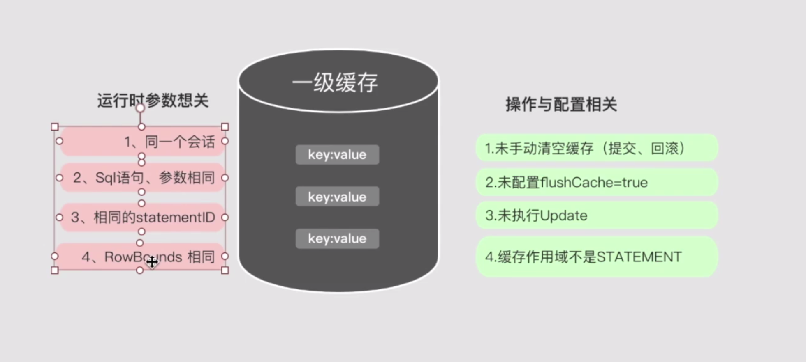
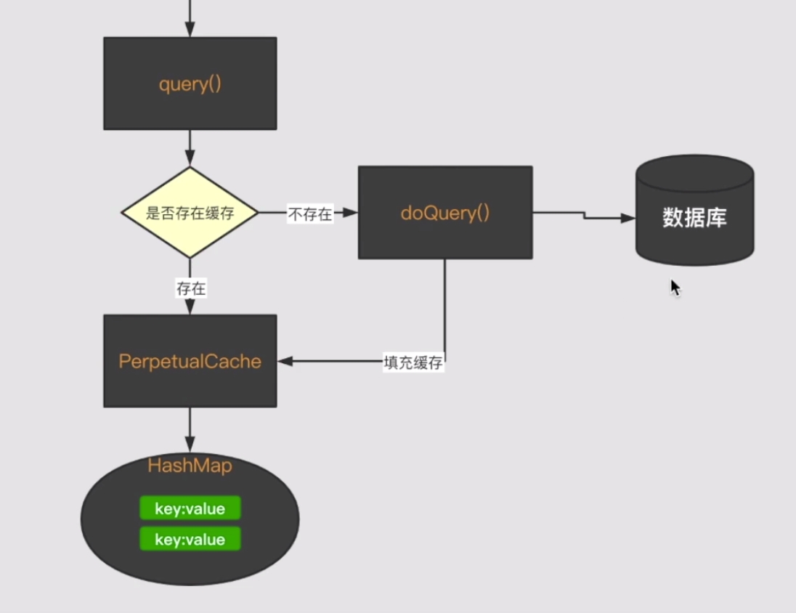

# 源码

## 1. 执行器 Executor

Executor接口中只有两种方法 update 和 query update操作包含insert update delete，query包含select操作，
这样设计的原因是update操作返回值为数字即影响的行数，select操作的返回值是ResultHandler返回的结果类型

1. 简单执行器 simpleExecutor，每次执行SQL需要预编译SQL语句。
2. 可重用执行器 ReuseExecutor，同一SQL语句执行只需要预编译一次SQL语句
3. 批处理执行器 BatchExecutor，只针对修改操作的SQL语句预编译一次，并且需要手动刷新SQL执行才生效。
4. 执行器抽象类 BaseExecutor，执行上面3个执行器的重复操作，比如一级缓存、doQuery、doUpdate方法。
5. 二级缓存 CachingExecutor，与一级缓存的区别：一级缓存查询数据库操作后会直接缓存，二级缓存需要当次数据库操作提交事务后才能进行缓存(二级缓存跨线程处理，一级缓存不用)。

### 执行逻辑


sqlSession->二级缓存->一级缓存->query->doQuery

二级缓存CachingExecutor中使用装饰器模式对BaseExecutor的实现类进行装饰，达到一级二级缓存同时使用的效果

### 一级缓存命中



1. sql和参数必须相同
2. 必须是相同的statementId即mapper中的方法名称
3. sqlSession必须相同
4. RowBound行范围必须相同
5. 未手动清空
5. 未调用flushCache=true查询
6. 未执行update操作，即使update语句中执行的是select语句
7. 缓存作用域是STATEMENT localCacheScope=STATEMENT
8. 不执行rollback

### 一级缓存源码




### 一级缓存总结

1. 和会话相关
2. 和查询条件有关
3. 和提交回滚有关

### 一级缓存失效

sqlSession和executor是一对一的，mybatis和spring整合之后sqlSession用的是不一样的， 会导致sqlSession失效，加上事务之后一级缓存生效

### spring


### 二级缓存

1. 一级缓存不能跨线程使用 与spring的整合中使用ThreadLocal作为sqlSession的缓存
2. 二级缓存可以跨线程调用，生命周期是整个应用，需要考虑容量

## 2. StatementHandler

### 2.1 StatementHandler接口

* Statement prepare(Connection connection)
    - 创建Statement对象，即该方法会通过Connection对象创建Statement对象。
* void parameterize(Statement statement)
    - 对Statement对象参数化，特别是PreapreStatement对象。
* void batch(Statement statement)
    - 批量执行SQL。
* int update(Statement statement)
    - 更新操作。
* < E> List< E> query(Statement statement, ResultHandler resultHandler)
    - 查询操作。
* BoundSql getBoundSql()
    - 获取SQL语句。
* ParameterHandler getParameterHandler()
    - 获取对应的参数处理器。

### 2.2 BaseStatementHandler StatementHandler接口实现类

StatementHandler的抽象实现类，SimpleStatementHandler、PrepareStatementHandler、CallableStatementHandler是其子类

* Configuration configuration
    - Mybatis全局配置对象。
* ObjectFactory objectFactory
    - 对象工厂。
* TypeHandlerRegistry typeHandlerRegistry
    - 类型注册器。
* ResultSetHandler resultSetHandler
    - 结果集Handler。
* ParameterHandler parameterHandler
    - 参数处理器Handler。
* Executor executor
    - SQL执行器。
* MappedStatement mappedStatement
    - SQL映射语句（Mapper.xml文件每一个方法对应一个MappedStatement对象）
* RowBounds rowBounds
    - 行边界，主要值分页参数limit、offset。
* BoundSql boundSql
    - 可以通过该对象获取SQL语句。

### 2.3 SimpleStatementHandler

具体的StatementHandler实现器，java.sql.Statement对象创建处理器。

### 2.4 PrepareStatementHandler

java.sql.PrepareStatement对象的创建处理器。

### 2.5 CallableStatementHandler

java.sql.CallableStatement对象的创建处理器，可用来执行存储过程调用的Statement。

### 2.6 RoutingStatementHandler

StatementHandler路由器，我们看一下其构造方法后

```java
public RoutingStatementHandler(Executor executor,MappedStatement ms,Object parameter,RowBounds rowBounds,ResultHandler resultHandler,BoundSql boundSql){

        switch(ms.getStatementType()){ // @1
        case STATEMENT:
        delegate=new SimpleStatementHandler(executor,ms,parameter,rowBounds,resultHandler,boundSql);
        break;
        case PREPARED:
        delegate=new PreparedStatementHandler(executor,ms,parameter,rowBounds,resultHandler,boundSql);
        break;
        case CALLABLE:
        delegate=new CallableStatementHandler(executor,ms,parameter,rowBounds,resultHandler,boundSql);
        break;
default:
        throw new ExecutorException("Unknown statement type: "+ms.getStatementType());
        }

        }
```

原来是会根据MappedStatement对象的statementType创建对应的StatementHandler

### 2.7 创建StatementHandler

Configuration#newStatementHandler

```java
public StatementHandler newStatementHandler(Executor executor,MappedStatement mappedStatement,Object parameterObject,RowBounds rowBounds,ResultHandler resultHandler,BoundSql boundSql){
        StatementHandler statementHandler=new RoutingStatementHandler(executor,mappedStatement,parameterObject,rowBounds,resultHandler,boundSql); // @1
        statementHandler=(StatementHandler)interceptorChain.pluginAll(statementHandler); // @2
        return statementHandler;
        }
```

该方法的两个关键点如下：

* 代码@1：创建RoutingStatementHandler对象，在其内部再根据SQL语句的类型，创建对应的StatementHandler对象。
* 代码@2：对StatementHandler引入拆件机制，该部分将在该专题的后续文章中会详细介绍，这里暂时跳过

## 3. ParameterHandler

参数处理器

### 3.1 ParameterHandler接口实现类

DefaultParameterHandler

### 3.2 创建ParameterHandler

Configuration#newParameterHandler

```java
public ParameterHandler newParameterHandler(MappedStatement mappedStatement,Object parameterObject,BoundSql boundSql){
        ParameterHandler parameterHandler=mappedStatement.getLang().createParameterHandler(mappedStatement,parameterObject,boundSql);
        parameterHandler=(ParameterHandler)interceptorChain.pluginAll(parameterHandler);  // @1
        return parameterHandler;
        }
```

同样该接口也支持插件化机制

## 4. ResultSetHandler

ResultSetHandler

### 4.1 ResultSetHandler实现类

DefaultParameterHandler

### 4.2 ResultSetHandler创建

Configuration#newResultSetHandler

```java
public ResultSetHandler newResultSetHandler(Executor executor,MappedStatement mappedStatement,RowBounds rowBounds,ParameterHandler parameterHandler,
        ResultHandler resultHandler,BoundSql boundSql){
        ResultSetHandler resultSetHandler=new DefaultResultSetHandler(executor,mappedStatement,parameterHandler,resultHandler,boundSql,rowBounds);
        resultSetHandler=(ResultSetHandler)interceptorChain.pluginAll(resultSetHandler);
        return resultSetHandler;
        }
```

同样支持插件化机制

## 5. mybatis插件

* [制作Mybatis插件---针对Mybatis的四大对象](https://blog.csdn.net/jinhaijing/article/details/84313668)

## 6. mybatis源码执行流程

### 6.1 SqlSessionFactory

* SqlSessionFactory的实现类有DefaultSqlSessionFactory和SqlSessionManager
* openSession()方法构建SqlSession
* openSessionFromDataSource()方法创建SqlSession
```java
private SqlSession openSessionFromDataSource(ExecutorType execType, TransactionIsolationLevel level, boolean autoCommit) {
    Transaction tx = null;
    try {
      final Environment environment = configuration.getEnvironment();
      final TransactionFactory transactionFactory = getTransactionFactoryFromEnvironment(environment);
      tx = transactionFactory.newTransaction(environment.getDataSource(), level, autoCommit);
      //executor在这创建
      final Executor executor = configuration.newExecutor(tx, execType);
      return new DefaultSqlSession(configuration, executor, autoCommit);
    } catch (Exception e) {
      closeTransaction(tx); // may have fetched a connection so lets call close()
      throw ExceptionFactory.wrapException("Error opening session.  Cause: " + e, e);
    } finally {
      ErrorContext.instance().reset();
    }
  }
```

#### 6.1.1 SqlSessionFactoryBuilder 创建SqlSessionFactory

从XML读取配置生成Configuration，生成SqlSessionFactory

```java
public SqlSessionFactory build(InputStream inputStream, String environment, Properties properties) {
    try {
      XMLConfigBuilder parser = new XMLConfigBuilder(inputStream, environment, properties);
      return build(parser.parse());
    } catch (Exception e) {
      throw ExceptionFactory.wrapException("Error building SqlSession.", e);
    } finally {
      ErrorContext.instance().reset();
      try {
        inputStream.close();
      } catch (IOException e) {
        // Intentionally ignore. Prefer previous error.
      }
    }
  }

  public SqlSessionFactory build(Configuration config) {
    return new DefaultSqlSessionFactory(config);
  }
```

### 6.2 Configuration类

#### 6.2.1 XMLConfigBuilder

* Configuration 的创建工作是有XMLConfigBuilder完成的
* 相关的核心方法XMLConfigBuilder#parse()
```java
public Configuration parse() {
    if (parsed) {
      throw new BuilderException("Each XMLConfigBuilder can only be used once.");
    }
    parsed = true;
    parseConfiguration(parser.evalNode("/configuration"));
    return configuration;
  }
```
* parseConfiguration 进行xml解析

```java
private void parseConfiguration(XNode root) {
    try {
      // issue #117 read properties first
      propertiesElement(root.evalNode("properties"));
      Properties settings = settingsAsProperties(root.evalNode("settings"));
      loadCustomVfs(settings);
      loadCustomLogImpl(settings);
      typeAliasesElement(root.evalNode("typeAliases"));
      //Plugins 解析
      pluginElement(root.evalNode("plugins"));
      objectFactoryElement(root.evalNode("objectFactory"));
      objectWrapperFactoryElement(root.evalNode("objectWrapperFactory"));
      reflectorFactoryElement(root.evalNode("reflectorFactory"));
      settingsElement(settings);
      // read it after objectFactory and objectWrapperFactory issue #631
      environmentsElement(root.evalNode("environments"));
      databaseIdProviderElement(root.evalNode("databaseIdProvider"));
      typeHandlerElement(root.evalNode("typeHandlers"));
      //解析mapper
      mapperElement(root.evalNode("mappers"));
    } catch (Exception e) {
      throw new BuilderException("Error parsing SQL Mapper Configuration. Cause: " + e, e);
    }
  }
```
* mapperElement()方法将mapper接口解析出来放入Configuration中

#### 6.2.2 Configuration方法解析

##### 1. Configuration#addMapper()

将解析出来的类放入mapperRegistry中

```java
public <T> void addMapper(Class<T> type) {
    mapperRegistry.addMapper(type);
  }
```

##### 2. MapperRegistry在Configuration中创建

* 创建
```java
protected final MapperRegistry mapperRegistry = new MapperRegistry(this);
```
* MapperRegistry#addMapper(Class<T> type)
```java
public void addMappers(String packageName, Class<?> superType) {
    ResolverUtil<Class<?>> resolverUtil = new ResolverUtil<>();
    resolverUtil.find(new ResolverUtil.IsA(superType), packageName);
    Set<Class<? extends Class<?>>> mapperSet = resolverUtil.getClasses();
    for (Class<?> mapperClass : mapperSet) {
      addMapper(mapperClass);
    }
  }
```
```java
public <T> void addMapper(Class<T> type) {
    if (type.isInterface()) {
      if (hasMapper(type)) {
        throw new BindingException("Type " + type + " is already known to the MapperRegistry.");
      }
      boolean loadCompleted = false;
      try {
        knownMappers.put(type, new MapperProxyFactory<>(type));
        // It's important that the type is added before the parser is run
        // otherwise the binding may automatically be attempted by the
        // mapper parser. If the type is already known, it won't try.
        MapperAnnotationBuilder parser = new MapperAnnotationBuilder(config, type);
        parser.parse();
        loadCompleted = true;
      } finally {
        if (!loadCompleted) {
          knownMappers.remove(type);
        }
      }
    }
  }
```

* 获取mapper
```java
public <T> T getMapper(Class<T> type, SqlSession sqlSession) {
    final MapperProxyFactory<T> mapperProxyFactory = (MapperProxyFactory<T>) knownMappers.get(type);
    if (mapperProxyFactory == null) {
      throw new BindingException("Type " + type + " is not known to the MapperRegistry.");
    }
    try {
      return mapperProxyFactory.newInstance(sqlSession);
    } catch (Exception e) {
      throw new BindingException("Error getting mapper instance. Cause: " + e, e);
    }
  }
```

##### 5. MapperProxyFactory

* mapperProxyFactory.newInstance(sqlSession)在这里创建mapper代理对象