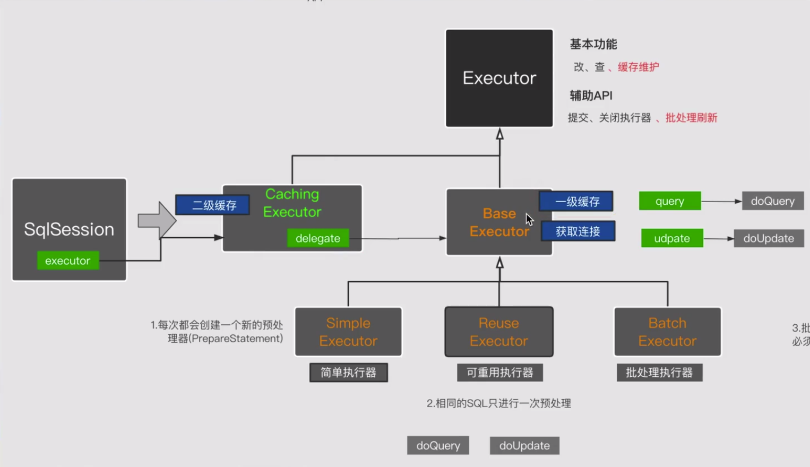

# 源码

## 执行器 Executor

Executor接口中只有两种方法 update 和 query update操作包含insert update delete，query包含select操作，
这样设计的原因是update操作返回值为数字即影响的行数，select操作的返回值是ResultHandler返回的结果类型

1. 简单执行器
simpleExecutor，每次执行SQL需要预编译SQL语句。
2. 可重用执行器
ReuseExecutor，同一SQL语句执行只需要预编译一次SQL语句
3. 批处理执行器
BatchExecutor，只针对修改操作的SQL语句预编译一次，并且需要手动刷新SQL执行才生效。
4. 执行器抽象类
BaseExecutor，执行上面3个执行器的重复操作，比如一级缓存、doQuery、doUpdate方法。
5. 二级缓存
CachingExecutor，与一级缓存的区别：一级缓存查询数据库操作后会直接缓存，二级缓存需要当次数据库操作提交事务后才能进行缓存(二级缓存跨线程处理，一级缓存不用)。

## 执行逻辑

sqlSession->二级缓存->一级缓存->query->doQuery

二级缓存CachingExecutor中使用装饰器模式对BaseExecutor的实现类进行装饰，达到一级二级缓存同时使用的效果