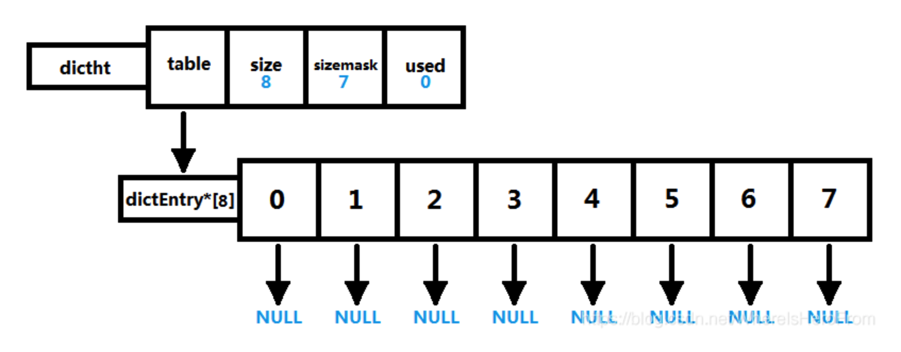
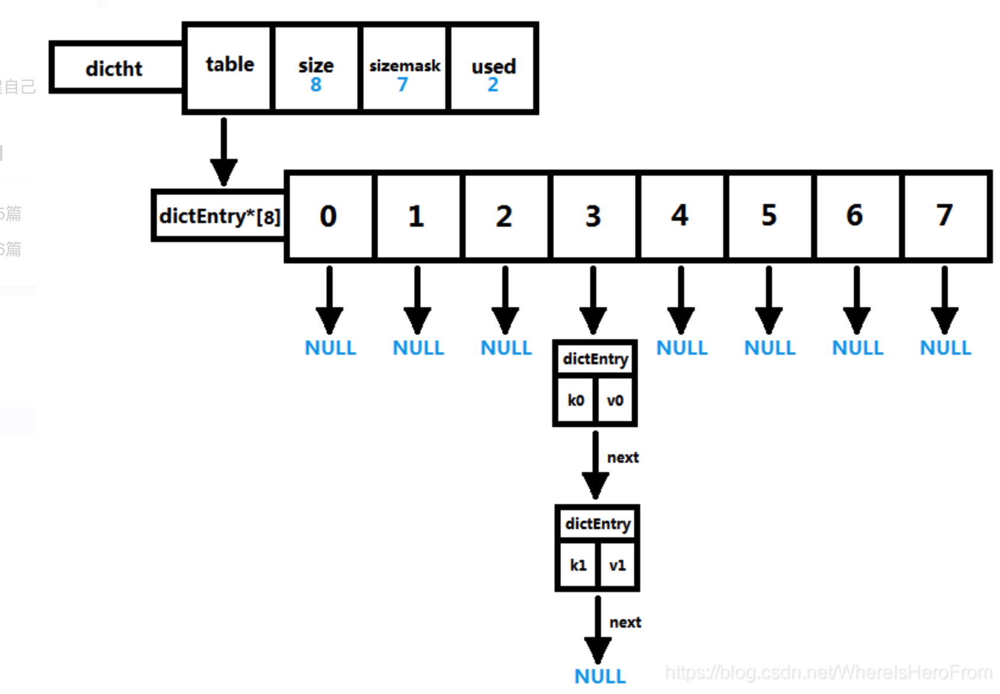

# Redis问题集锦

## 1. 概述

### 1.1 什么是 Redis？
### 1.2 Redis 有哪些优缺点？
### 1.3 为什么要用 Redis / 为什么要用缓存？
### 1.4 为什么要用 Redis 而不用 map/guava 做缓存?
### 1.5 Redis 为什么这么快？

## 2. 数据类型

### 2.1 Redis 有哪些数据类型？
### 2.2 Redis 的应用场景？

1. 缓存
2. 发布订阅

### 2.3 跳跃表

[redis跳跃表](https://blog.csdn.net/lz710117239/article/details/78408919)

1. Redis使用跳跃表作为有序集合键的底层实现之一，若一个有序集合包含的元素数量比较多，
或者有序集合中的成员是比较长的字符串时，Redis就会使用跳跃表来作为有序集合键的底层实现
2. 和链表、字典等数据结构被广泛地应用在Redis内部不同，Redis只在两个地方用到了跳跃表，
一个是实现有序集合键，另一个是在集群结点中用作内部数据结构。除此之外，跳跃表在Redis里面没有其他用途。

```cpp
typedef struct zskiplistNode {  
    robj *obj;  
    double score;  
    struct zskiplistNode *backward;  
    struct zskiplistLevel {  
        struct zskiplistNode *forward;  
        unsigned int span;  
    } level[];  
} zskiplistNode;
```
3. 每次创建一个新跳跃表结点的时候，程序都根据幂次定律（power law，越大的数出现的概率越小）
随机生成一个介于1和32之间的值作为level数组的大小，这个大小就是该结点包含的层数。
4. Redis中的跳跃表，与普通跳跃表的区别之一，就是包含了层跨度(level[i].span)的概念。
这是因为在有序集合支持的命令中，有些跟元素在集合中的排名有关，比如获取元素的排名，根据排名获取、删除元素等。
通过跳跃表结点的层跨度，可以快速得到该结点在跳跃表中的排名。
5. 计算结点的排名，就是在查找某个结点的过程中，将沿途访问过的所有结点的层跨度累加起来，得到的结果就是目标结点在跳跃表中的排名。
6. 层跨度用于记录本层两个相邻结点之间的距离，举个例子，如下图的跳跃表：

7. 跳跃表头结点（header指向的节点）排名为0，之后的节点排名以此类推。在上图跳跃表中查找计算分值为3.0、成员对象为o3的结点的排名。查找过程只遍历了头结点的L5层就找到了，并且头结点该层的跨度为3，因此得到该结点在跳跃表中的排名为3。
8. 如果要查找分值为2.0、成员对象为o2的结点，查找结点的过程中，首先经过头结点的L4层，然后是o1结点的L2层，也就是经过了两个层跨度为1的结点，因此得到目标结点在跳跃表中的排名为2。
9. Redis中的跳跃表，与普通跳跃表的另一个区别就是，每个结点还有一个前继指针backward。可用于从表尾向表头方向访问结点。通过结点的前继指针，组成了一个普通的链表。因为每个结点只有一个前继指针，所以只能依次访问结点，而不能跳过结点。

```cpp
typedef struct zskiplist {  
    struct zskiplistNode *header, *tail;  
    unsigned long length;  
    int level;  
} zskiplist;
```
10. header和tail指针分别指向跳跃表的表头结点和表尾结点，通过这两个指针，定位表头结点和表尾结点的复杂度为O(1)。表尾结点是表中最后一个结点。而表头结点实际上是一个伪结点，该结点的成员对象为NULL，分值为0，它的层数固定为32（层的最大值）。
11. length属性记录结点的数最，程序可以在O(1)的时间复杂度内返回跳跃表的长度。
12. level属性记录跳跃表的层数，也就是表中层高最大的那个结点的层数，注意，表头结点的层高并不计算在内。
13. 下面就是一个zskiplist表示的跳跃表：


### 2.4 哈希表

### 2.4.1 哈希表结构

[哈希表](https://blog.csdn.net/whereisherofrom/article/details/80833863)

1. 哈希表的结构定义在 dict.h/dictht ：

```cpp
typedef struct dictht {
    dictEntry **table;             // 哈希表数组
    unsigned long size;            // 哈希表数组的大小
    unsigned long sizemask;        // 用于映射位置的掩码，值永远等于(size-1)
    unsigned long used;            // 哈希表已有节点的数量
} dictht;
```
  * table 是一个数组，数组的每个元素都是一个指向 dict.h/dictEntry 结构的指针；
  * size 记录哈希表的大小，即 table 数组的大小，且一定是2的幂；
  * used 记录哈希表中已有结点的数量；
  * sizemask 用于对哈希过的键进行映射，索引到 table 的下标中，且值永远等于 size-1。
  具体映射方法很简单，就是对 哈希值 和 sizemask 进行位与操作，由于 size 一定是2的幂，
  所以 sizemask=size-1，自然它的二进制表示的每一个位(bit)都是1，等同于上文提到的取模；
2. 如图所示，为一个长度为8的空哈希表。


### 2.4.2 哈希表节点

1. 哈希表节点用 dict.h/dictEntry 结构表示，每个 dictEntry 结构存储着一个键值对，且存有一个 next 指针来保持链表结构：

```cpp
typedef struct dictEntry {
    void *key;                  // 键
    union {                     // 值
        void *val;
        uint64_t u64;
        int64_t s64;
        double d;
    } v;
    struct dictEntry *next;     // 指向下一个哈希表节点，形成单向链表
} dictEntry;
```
  * key 是键值对中的键；
  * v 是键值对中的值，它是一个联合类型，方便存储各种结构；
  * next 是链表指针，指向下一个哈希表节点，他将多个哈希值相同的键值对串联在一起，用于解决键冲突；
  如图所示，两个dictEntry 的 key 分别是 k0 和 k1，通过某种哈希算法计算出来的哈希值和 sizemask 
  进行位与运算后都等于 3，所以都被放在了 table 数组的 3号槽中，并且用 next 指针串联起来。


### 2.4.3 字典

1. Redis中字典结构由 dict.h/dict 表示：
```cpp
typedef struct dict {
    dictType *type;                        // 和类型相关的处理函数
    void *privdata;                        // 上述类型函数对应的可选参数
    dictht ht[2];                          // 两张哈希表，ht[0]为原生哈希表，ht[1]为 rehash 哈希表
    long rehashidx;                        // 当等于-1时表示没有在 rehash，否则表示 rehash 的下标
    int iterators;                         // 迭代器数量(暂且不谈)
} dict;
```
  * type 是一个指向 dict.h/dictType 结构的指针，保存了一系列用于操作特定类型键值对的函数；
  * privdata 保存了需要传给上述特定函数的可选参数；
  * ht 是两个哈希表，一般情况下，只使用ht[0]，只有当哈希表的键值对数量超过负载(元素过多)时，才会将键值对迁移到ht[1]，这一步迁移被称为 rehash (重哈希)，rehash 会在下文进行详细介绍；
  * rehashidx 由于哈希表键值对有可能很多很多，所以 rehash 不是瞬间完成的，需要按部就班，那么 rehashidx 就记录了当前 rehash 的进度，当 rehash 完毕后，将 rehashidx 置为-1；
  
### 2.4.4 类型处理函数

类型处理函数全部定义在 dict.h/dictType 中：

```cpp
typedef struct dictType {
    unsigned int (*hashFunction)(const void *key);                                         // 计算哈希值的函数
    void *(*keyDup)(void *privdata, const void *key);                                      // 复制键的函数
    void *(*valDup)(void *privdata, const void *obj);                                      // 复制值的函数
    int (*keyCompare)(void *privdata, const void *key1, const void *key2);                 // 比较键的函数
    void (*keyDestructor)(void *privdata, void *key);                                      // 销毁键的函数
    void (*valDestructor)(void *privdata, void *obj);                                      // 销毁值的函数
} dictType;
```

### 2.4.5 rehash

随着字典操作的不断执行，哈希表保存的键值对会不断增多（或者减少），为了让哈希表的负载因子维持在一个合理的范围之内，当哈希表保存的键值对数量太多或者太少时，需要对哈希表大小进行扩展或者收缩。

1. 负载因子
 * 这里提到了一个负载因子，其实就是当前已使用结点数量除上哈希表的大小，即：
    ```load_factor = ht[0].used / ht[0].size```
2. 哈希表扩展
  * 当哈希表的负载因子大于5时，为 ht[1] 分配空间，大小为第一个大于等于 ht[0].used * 2 的 2 的幂；
  * 将保存在 ht[0] 上的键值对 rehash 到 ht[1] 上，rehash 就是重新计算哈希值和索引，并且重新插入到 ht[1] 中，插入一个删除一个；
  * 当 ht[0] 包含的所有键值对全部 rehash 到 ht[1] 上后，释放 ht[0] 的控件， 将 ht[1] 设置为 ht[0]，并且在 ht[1] 上新创件一个空的哈希表，为下一次 rehash 做准备；
  * Redis 中 实现哈希表扩展调用的是 dict.c/_dictExpandIfNeeded 函数：
```cpp
static int _dictExpandIfNeeded(dict *d)
{
    if (dictIsRehashing(d)) return DICT_OK;
    if (d->ht[0].size == 0) return dictExpand(d, DICT_HT_INITIAL_SIZE);          // 大小为0需要设置初始哈希表大小为4
    if (d->ht[0].used >= d->ht[0].size &&
        (dict_can_resize ||
         d->ht[0].used/d->ht[0].size > dict_force_resize_ratio))                 // 负载因子超过5，执行 dictExpand
    {
        return dictExpand(d, d->ht[0].used*2);
    }
    return DICT_OK;
}
```
3. 哈希表收缩
 * 哈希表的收缩，同样是为 ht[1] 分配空间， 大小等于 max( ht[0].used, DICT_HT_INITIAL_SIZE )，然后和扩展做同样的处理即可。

### 2.4.6 渐进式rehash

扩展或者收缩哈希表的时候，需要将 ht[0] 里面所有的键值对 rehash 到 ht[1] 里，当键值对数量非常多的时候，
这个操作如果在一帧内完成，大量的计算很可能导致服务器宕机，所以不能一次性完成，需要渐进式的完成。
渐进式 rehash 的详细步骤如下：

1. 为 ht[1] 分配指定空间，让字典同时持有 ht[0] 和 ht[1] 两个哈希表；
2. 将 rehashidx 设置为0，表示正式开始 rehash，前两步是在 dict.c/dictExpand 中实现的：
```cpp

int dictExpand(dict *d, unsigned long size)
{
    dictht n;
    unsigned long realsize = _dictNextPower(size);                      // 找到比size大的最小的2的幂
    if (dictIsRehashing(d) || d->ht[0].used > size)
        return DICT_ERR;
    if (realsize == d->ht[0].size) return DICT_ERR;
 
    n.size = realsize;                                                 // 给ht[1]分配 realsize 的空间
    n.sizemask = realsize-1;
    n.table = zcalloc(realsize*sizeof(dictEntry*));
    n.used = 0;
    if (d->ht[0].table == NULL) {                                      // 处于初始化阶段
        d->ht[0] = n;
        return DICT_OK;
    }
    d->ht[1] = n;
    d->rehashidx = 0;                                                  // rehashidx 设置为0，开始渐进式 rehash
    return DICT_OK;
}
```

3. 在进行 rehash 期间，每次对字典执行 增、删、改、查操作时，程序除了执行指定的操作外，
还会将 哈希表 ht[0].table中下标为 rehashidx 位置上的所有的键值对 全部迁移到 ht[1].table 上，
完成后 rehashidx 自增。这一步就是 rehash 的关键一步。为了防止 ht[0] 是个稀疏表 （遍历很久遇到的都是NULL），
从而导致函数阻塞时间太长，这里引入了一个 “最大空格访问数”，也即代码中的 enmty_visits，初始值为 n*10。
当遇到NULL的数量超过这个初始值直接返回。
4. 最后，当 ht[0].used 变为0时，代表所有的键值对都已经从 ht[0] 迁移到 ht[1] 了，释放 ht[0].table， 
并且将 ht[0] 设置为 ht[1]，rehashidx 标记为 -1 代表 rehash 结束

## 3. 持久化

### 3.1 什么是 Redis 持久化？

### 3.2 Redis 的持久化机制是什么？各自的优缺点？
### 3.3 如何选择合适的持久化方式
### 3.4 Redis 持久化数据和缓存怎么做扩容？
### 3.5 过期键的删除策略
### 3.6 Redis 的过期键的删除策略

#### 3.6.1 定时删除

* 在设置键的过期时间的同时，创建一个定时器，让定时器在键的过期时间来临时，立即执行对键的删除操作。
* 定时删除策略通过使用定时器，定时删除策略可以保证过期键尽可能快地被删除，并释放过期键占用的内存。
  - 优点：对内存非常友好
  - 缺点：对CPU时间非常不友好
  - 举个例子，如果有大量的命令请求等待服务器处理，并且服务器当前不缺少内存，如果服务器将大量的CPU时间用来删除过期键，那么服务器的响应时间和吞吐量就会受到影响。
 也就是说，如果服务器创建大量的定时器，服务器处理命令请求的性能就会降低，
 因此Redis目前并没有使用定时删除策略。
 
#### 3.6.2 惰性删除

* 放任过期键不管，每次从键空间中获取键时，检查该键是否过期，如果过期，就删除该键，如果没有过期，就返回该键。
* 惰性删除策略只会在获取键时才对键进行过期检查，不会在删除其它无关的过期键花费过多的CPU时间。
  - 优点：对CPU时间非常友好
  - 缺点：对内存非常不友好
  - 举个例子，如果数据库有很多的过期键，而这些过期键又恰好一直没有被访问到，那这些过期键就会一直占用着宝贵的内存资源，造成资源浪费。
  
#### 3.6.3 定期删除

* 每隔一段时间，程序对数据库进行一次检查，删除里面的过期键，至于要删除哪些数据库的哪些过期键，则由算法决定。
* 定期删除策略是定时删除策略和惰性删除策略的一种整合折中方案。
* 定期删除策略每隔一段时间执行一次删除过期键操作，并通过限制删除操作执行的时长和频率来减少删除操作对CPU时间的影响，同时，通过定期删除过期键，也有效地减少了因为过期键而带来的内存浪费。

#### 3.6.4 Redis使用的过期键删除策略

Redis服务器使用的是惰性删除策略和定期删除策略。

##### 1. 惰性删除策略的实现

过期键的惰性删除策略由expireIfNeeded函数实现，所有读写数据库的Redis命令在执行之前都会调用expireIfNeeded函数对输入键进行检查：
* 如果输入键已经过期，那么将输入键从数据库中删除
* 如果输入键未过期，那么不做任何处理

##### 2. 定期删除策略的实现

过期键的定期删除策略由activeExpireCycle函数实现，每当Redis服务器的周期性操作serverCron函数执行时，activeExpireCycle函数就会被调用，它在规定的时间内，分多次遍历服务器中的各个数据库，从数据库的expires字典中随机检查一部分键的过期时间，并删除其中的过期键。

activeExpireCycle函数的大体流程为：

函数每次运行时，都从一定数量的数据库中随机取出一定数量的键进行检查，并删除其中的过期键，比如先从0号数据库开始检查，下次函数运行时，可能就是从1号数据库开始检查，直到15号数据库检查完毕，又重新从0号数据库开始检查，这样可以保证每个数据库都被检查到。

##### 3. RDB对过期键的处理

1. 在执行SAVE命令或者BGSAVE命令创建一个新的RDB文件时，程序会对数据库中的键进行检查，已过期的键不会被保存到新创建的RDB文件中。
举个例子，如果数据库中包含3个键k1、k2、k3，并且k2已经过期，那么创建新的RDB文件时，程序只会将k1和k3保存到RDB文件中，k2则会被忽略。
2. 载入RDB文件
* 在启动Redis服务器时，如果服务器只开启了RDB持久化，那么服务器将会载入RDB文件：
  - 如果服务器以主服务器模式运行，在载入RDB文件时，程序会对文件中保存的键进行检查，未过期的键会被载入到数据库中，过期键会被忽略。
  - 如果服务器以从服务器模式运行，在载入RDB文件时，文件中保存的所有键，不论是否过期，都会被载入到数据库中。
  - 因为主从服务器在进行数据同步（完整重同步）的时候，从服务器的数据库会被清空，所以一般情况下，过期键对载入RDB文件的从服务器不会造成影响。
  
##### 4. AOF对过期键的处理

AOF文件写入
1. 如果数据库中的某个键已经过期，并且服务器开启了AOF持久化功能，当过期键被惰性删除或者定期删除后，程序会向AOF文件追加一条DEL命令，显式记录该键已被删除。
举个例子，如果客户端执行命令GET message访问已经过期的message键，那么服务器将执行以下3个动作：

2. 从数据库中删除message键
  * 追加一条DEL message命令到AOF文件
  * 向执行GET message命令的客户端返回空回复
3. AOF文件重写
在执行AOF文件重写时，程序会对数据库中的键进行检查，已过期的键不会被保存到重写后的AOF文件中。

##### 5. 复制功能对过期键的处理

在主从复制模式下，从服务器的过期键删除动作由主服务器控制：
         
* 主服务器在删除一个过期键后，会显式地向所有从服务器发送一个DEL命令，告知从服务器删除这个过期键。
* 从服务器在执行客户端发送的读命令时，即使发现该键已过期也不会删除该键，照常返回该键的值。
* 从服务器只有接收到主服务器发送的DEL命令后，才会删除过期键。

### 3.8 Redis 内存淘汰机制

如果redis的内存占用过多的时候，此时会进行内存淘汰，有如下一些策略：

1. noeviction：当内存不足以容纳新写入数据时，新写入操作会报错，这个一般没人用吧
2. allkeys-lru：当内存不足以容纳新写入数据时，在键空间中，移除最近最少使用的key（这个是最常用的）
3. allkeys-random：当内存不足以容纳新写入数据时，在键空间中，随机移除某个key，这个一般没人用吧
4. volatile-lru：当内存不足以容纳新写入数据时，在设置了过期时间的键空间中，移除最近最少使用的key（这个一般不太合适）
5. volatile-random：当内存不足以容纳新写入数据时，在设置了过期时间的键空间中，随机移除某个key
6. volatile-ttl：当内存不足以容纳新写入数据时，在设置了过期时间的键空间中，有更早过期时间的key优先移除

### 3.7 Redis key 的过期时间和永久有效分别怎么设置？
### 3.8 我们知道通过 expire 来设置 key 的过期时间，那么对过期的数据怎么处理呢?

## 4. 内存相关

### 4.1 MySQL 里有 2000w 数据，redis 中只存 20w 的数据，如何保证 redis 中的数据都是热点数据
### 4.2 Redis 的内存淘汰策略有哪些
### 4.3 Redis 主要消耗什么物理资源？
### 4.4 Redis 的内存用完了会发生什么？
### 4.5 Redis 如何做内存优化？

## 5. 线程模型

### 5.1 Redis 线程模型

## 6. 事务

### 6.1 什么是事务？
### 6.2 Redis 事务的概念
### 6.3 Redis 事务的三个阶段
### 6.4 Redis 事务相关命令
### 6.5 事务管理（ACID）概述
### 6.6 Redis 事务支持隔离性吗
### 6.7 Redis 事务保证原子性吗，支持回滚吗
### 6.8 Redis 事务其他实现

## 7. 集群方案

### 7.1 哨兵模式
### 7.2 官方 Redis Cluster 方案(服务端路由查询)
### 7.3 基于客户端分配
### 7.4 基于代理服务器分片

## 8. Redis 主从架构

### 8.1 Redis 集群的主从复制模型是怎样的？
### 8.2 生产环境中的 redis 是怎么部署的？
### 8.3 说说 Redis 哈希槽的概念？
### 8.4 Redis 集群会有写操作丢失吗？为什么？
### 8.5 Redis 集群之间是如何复制的？
### 8.6 Redis 集群最大节点个数是多少？
### 8.7 Redis 集群如何选择数据库？

## 9. 分区

### 9.1 Redis 是单线程的，如何提高多核CPU的利用率？
### 9.2 为什么要做 Redis 分区？
### 9.3 你知道有哪些 Redis 分区实现方案？
### 9.4 Redis 分区有什么缺点？
### 9.5 分布式问题

## 10. Redis 实现分布式锁
### 10.1 如何解决 Redis 的并发竞争 Key 问题
### 10.2 分布式 Redis 是前期做还是后期规模上来了再做好？为什么？
### 10.3 什么是 RedLock

## 11. 缓存异常

### 11.1 缓存雪崩
### 11.2 缓存穿透
### 11.3 缓存击穿
### 11.4 缓存预热
### 11.5 缓存降级
### 11.6 热点数据和冷数据
### 11.7 缓存热点 key

## 12. 常用工具

### 12.1 Redis 支持的 Java 客户端都有哪些？官方推荐用哪个？
### 12.2 Redis 和 Redisson 有什么关系？
### 12.3 Jedis 与 Redisson 对比有什么优缺点？

## 13. 其他问题

### 13.1 Redis 与 Memcached 的区别
### 13.2 如何保证缓存与数据库双写时的数据一致性？
### 13.3 Redis 常见性能问题和解决方案？
### 13.4 Redis 官方为什么不提供 Windows 版本？
### 13.5 一个字符串类型的值能存储最大容量是多少？
### 13.6 Redis 如何做大量数据插入？
### 13.7 假如 Redis 里面有 1 亿个 key，其中有 10w 个 key 是以某个固定的已知的前缀开头的，如果将它们全部找出来？
### 13.8 使用 Redis 做过异步队列吗，是如何实现的
### 13.9 Redis 如何实现延时队列
### 13.10 Redis 回收进程如何工作的？
### 13.11 Redis 回收使用的是什么算法？
