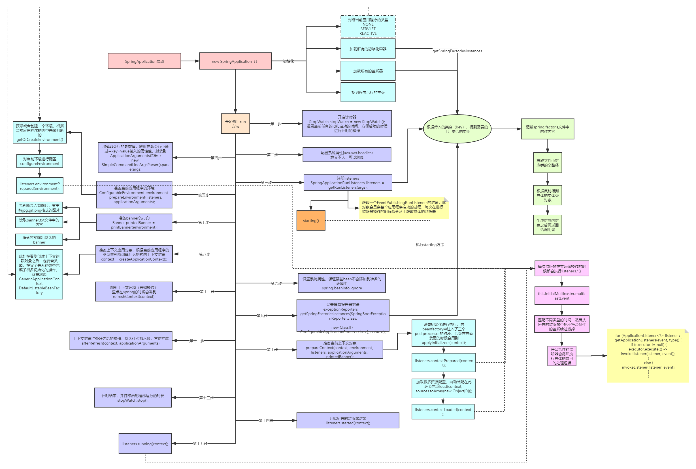
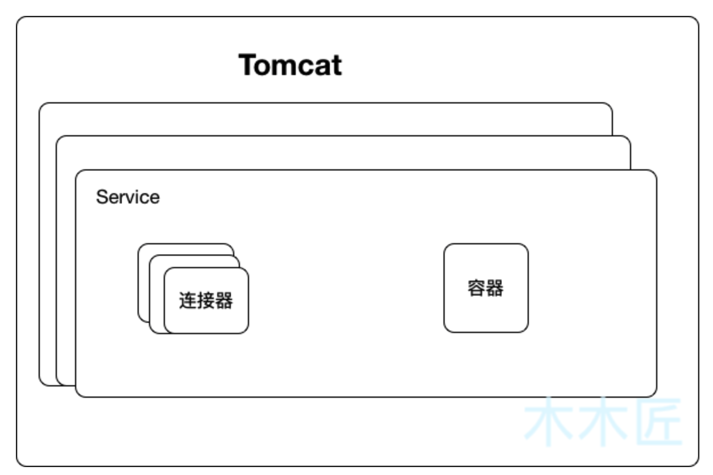

# springboot源码解析

* [SpringBoot 2.2.2 源码详解(一)：启动过程](https://blog.csdn.net/qq_43186095/article/details/103840365)
* [SpringBoot2 | SpringBoot启动流程源码分析（一）](https://blog.csdn.net/woshilijiuyi/article/details/82219585)



## 1. 启动过程

## 2. 零配置tomcat

使用java spi机制 对 ServletContainerInitializer进行默认实现
实现类为 SpringServletContainerInitializer
@HandlesTypes注解 找接口的实现 不找配置的类本身

### 2.1 Tomcat在SpringBoot中是如何启动的

[Tomcat在SpringBoot中是如何启动的](https://blog.csdn.net/qq_32101993/article/details/99700910)

springboot分析与tomcat相关的两个方法:
1. 上下文是如何创建的，对应方法：createApplicationContext()
2. 上下文是如何刷新的，对应方法：refreshContext(context)

* SpringBootServletInitializer这个类使用到了AnnotationConfigServletWebServerApplicationContext
* AnnotationConfigServletWebServerApplicationContext继承于ServletWebServerApplicationContext

#### 2.1.1 ServletWebServerApplicationContext分析

##### 1. createWebServer()方法

1. ServletWebServerFactory接口有个实现为TomcatServletWebServerFactory
2. TomcatServletWebServerFactory#getWebServer() 方法创建Tomcat

```java_holder_method_tree
@Override
	public WebServer getWebServer(ServletContextInitializer... initializers) {
		if (this.disableMBeanRegistry) {
			Registry.disableRegistry();
		}
		Tomcat tomcat = new Tomcat();
		File baseDir = (this.baseDirectory != null) ? this.baseDirectory : createTempDir("tomcat");
		tomcat.setBaseDir(baseDir.getAbsolutePath());
		Connector connector = new Connector(this.protocol);
		connector.setThrowOnFailure(true);
		tomcat.getService().addConnector(connector);
		customizeConnector(connector);
		tomcat.setConnector(connector);
		tomcat.getHost().setAutoDeploy(false);
		configureEngine(tomcat.getEngine());
		for (Connector additionalConnector : this.additionalTomcatConnectors) {
			tomcat.getService().addConnector(additionalConnector);
		}
		prepareContext(tomcat.getHost(), initializers);
		return getTomcatWebServer(tomcat);
	}
```
根据上面的代码，我们发现其实主要做两件事，
* 第一件事就是把Connnctor(我们称之为连接器)对象添加到Tomcat中；
* 第二件事就是configureEngine，这连接器我们勉强能理解(不理解后面会述说)，那这个Engine是什么呢?查看tomcat.getEngine()的源码

```java_holder_method_tree
public Engine getEngine() {
        Service service = getServer().findServices()[0];
        if (service.getContainer() != null) {
            return service.getContainer();
        }
        Engine engine = new StandardEngine();
        engine.setName( "Tomcat" );
        engine.setDefaultHost(hostname);
        engine.setRealm(createDefaultRealm());
        service.setContainer(engine);
        return engine;
    }
```

* Engine是最高级别的容器，其子容器是Host，Host的子容器是Context，Wrapper是Context的子容器，所以这4个容器的关系就是父子关系。
也就是：Engine > Host > Context > Wrapper

##### 2 tomcat代码

```java
//部分代码
public class Tomcat {

	//设置连接器
    public void setConnector(Connector connector) {
        Service service = getService();
        boolean found = false;
        for (Connector serviceConnector : service.findConnectors()) {
            if (connector == serviceConnector) {
                found = true;
            }
        }
        if (!found) {
            service.addConnector(connector);
        }
    }

	//获取service
    public Service getService() {
        return getServer().findServices()[0];
    }

    //设置Host容器
    public void setHost(Host host) {
        Engine engine = getEngine();
        boolean found = false;
        for (Container engineHost : engine.findChildren()) {
            if (engineHost == host) {
                found = true;
            }
        }
        if (!found) {
            engine.addChild(host);
        }
    }

    //获取Engine容器
    public Engine getEngine() {
        Service service = getServer().findServices()[0];
        if (service.getContainer() != null) {
            return service.getContainer();
        }
        Engine engine = new StandardEngine();
        engine.setName( "Tomcat" );
        engine.setDefaultHost(hostname);
        engine.setRealm(createDefaultRealm());
        service.setContainer(engine);
        return engine;
    }

    //获取server
    public Server getServer() {

        if (server != null) {
            return server;
        }

        System.setProperty("catalina.useNaming", "false");

        server = new StandardServer();

        initBaseDir();

        server.setPort( -1 );

        Service service = new StandardService();
        service.setName("Tomcat");
        server.addService(service);
        return server;
    }

    //添加context容器
    public Context addContext(Host host, String contextPath, String contextName,
            String dir) {
        silence(host, contextName);
        Context ctx = createContext(host, contextPath);
        ctx.setName(contextName);
        ctx.setPath(contextPath);
        ctx.setDocBase(dir);
        ctx.addLifecycleListener(new FixContextListener());

        if (host == null) {
            getHost().addChild(ctx);
        } else {
            host.addChild(ctx);
        }
        return ctx;
    }

    //添加Wrapper容器
    public Context addWebapp(Host host, String contextPath, String docBase) {
        LifecycleListener listener = null;
        try {
            Class<?> clazz = Class.forName(getHost().getConfigClass());
            listener = (LifecycleListener) clazz.getConstructor().newInstance();
        } catch (ReflectiveOperationException e) {
            // Wrap in IAE since we can't easily change the method signature to
            // to throw the specific checked exceptions
            throw new IllegalArgumentException(e);
        }

        return addWebapp(host,  contextPath, docBase, listener);
    }
}
```

阅读Tomcat的getServer()方法，我们可以知道，Tomcat的最顶层就是Server，也就是Tomcat的实例，一个Tomcat一个Server；
通过getEngine()我们可以了解到Server下面是Service,而且是多个，一个Service代表我们部署的一个应用，还可以知道，
Engine容器，一个Service只有一个；根据父子关系，通过setHost()源码可知，host容器有多个；同理，我们发现addContext()源码下，
Context也是多个；addServlet()表明Wrapper容器也是多个，而且这段代码也暗示了，其实Wrapper和Servlet是一层意思。
另外我们根据setConnector源码可以知道，连接器(Connector)是设置在Service下的，而且是可以设置多个连接器(Connector)

可以总结出Tomcat主要包含了 2 个核心组件：连接器(Connector)和容器(Container)，用图表示如下



一个Tomcat是一个Server,一个Server下有多个Service，也就是我们部署的多个应用，一个应用下有多个连接器(Connector)和一个容器（Container）,容器下有多个子容器:


Engine下有多个Host子容器，Host下有多个Context子容器，Context下有多个Wrapper子容器。

##### 3. springboot启动tomcat

启动Tomcat就是在第7步的“刷新上下文”；Tomcat的启动主要是初始化2个核心组件，连接器(Connector)和容器（Container），一个Tomcat实例就是一个Server，
一个Server包含多个Service，也就是多个应用程序，每个Service包含多个连接器（Connetor）和一个容器（Container)，而容器下又有多个子容器，
按照父子关系分别为：Engine、Host、Context、Wrapper，其中除了Engine外，其余的容器都是可以有多个。

refreshContext()->refresh()->onRefresh();
