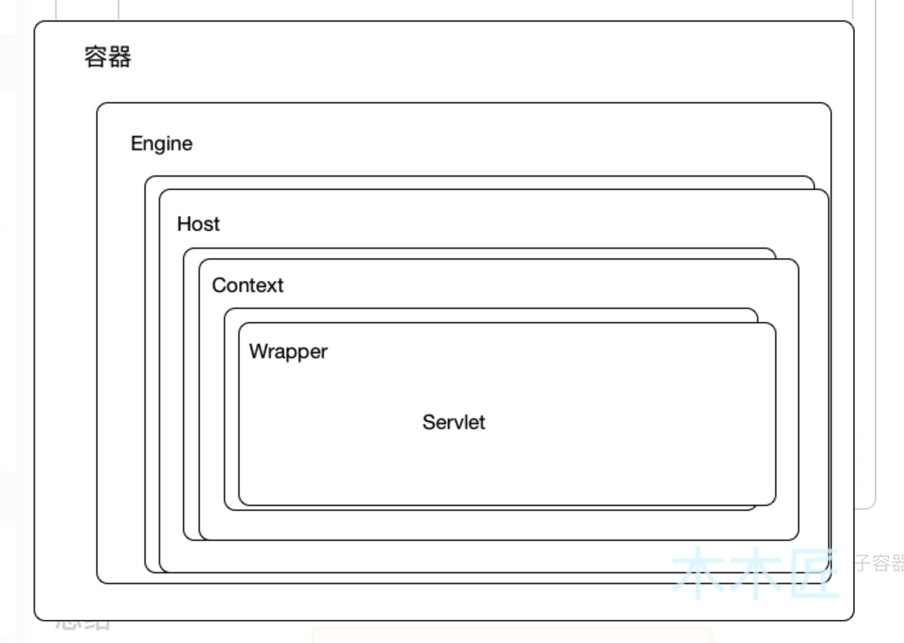
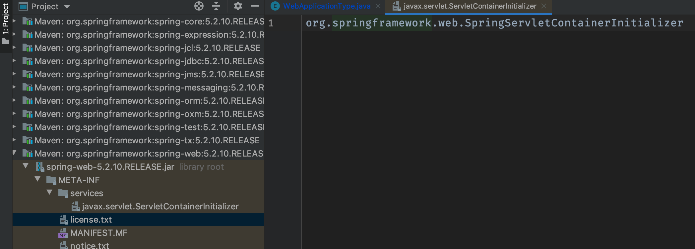
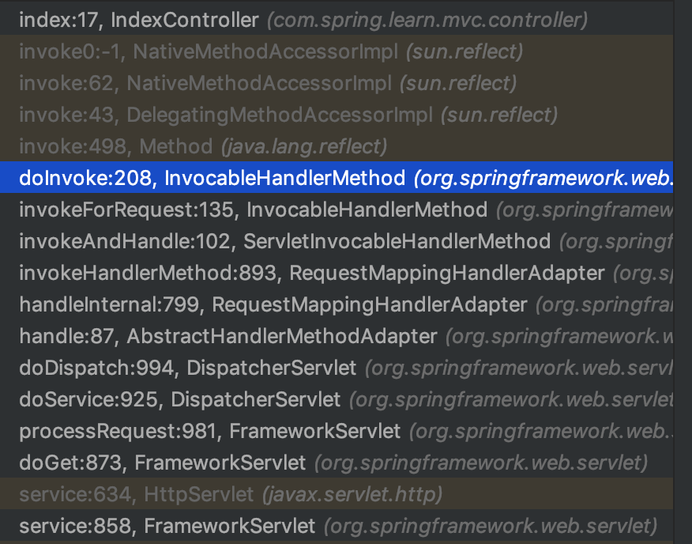

# springboot源码解析

* [SpringBoot 2.2.2 源码详解(一)：启动过程](https://blog.csdn.net/qq_43186095/article/details/103840365)
* [SpringBoot2 | SpringBoot启动流程源码分析（一）](https://blog.csdn.net/woshilijiuyi/article/details/82219585)


## 1. 启动过程

## 2. 零配置tomcat

使用java spi机制 对 ServletContainerInitializer进行默认实现
实现类为 SpringServletContainerInitializer
@HandlesTypes注解 找接口的实现 不找配置的类本身

### 2.1 Tomcat在SpringBoot中是如何启动的

[Tomcat在SpringBoot中是如何启动的](https://blog.csdn.net/qq_32101993/article/details/99700910)

springboot分析与tomcat相关的两个方法:
1. 上下文是如何创建的，对应方法：createApplicationContext()
2. 上下文是如何刷新的，对应方法：refreshContext(context)

* SpringBootServletInitializer这个类使用到了AnnotationConfigServletWebServerApplicationContext
* AnnotationConfigServletWebServerApplicationContext继承于ServletWebServerApplicationContext

#### 2.1.1 ServletWebServerApplicationContext分析

##### 1. createWebServer()方法

1. ServletWebServerFactory接口有个实现为TomcatServletWebServerFactory
2. TomcatServletWebServerFactory#getWebServer() 方法创建Tomcat

```java_holder_method_tree
@Override
	public WebServer getWebServer(ServletContextInitializer... initializers) {
		if (this.disableMBeanRegistry) {
			Registry.disableRegistry();
		}
		Tomcat tomcat = new Tomcat();
		File baseDir = (this.baseDirectory != null) ? this.baseDirectory : createTempDir("tomcat");
		tomcat.setBaseDir(baseDir.getAbsolutePath());
		Connector connector = new Connector(this.protocol);
		connector.setThrowOnFailure(true);
		tomcat.getService().addConnector(connector);
		customizeConnector(connector);
		tomcat.setConnector(connector);
		tomcat.getHost().setAutoDeploy(false);
		configureEngine(tomcat.getEngine());
		for (Connector additionalConnector : this.additionalTomcatConnectors) {
			tomcat.getService().addConnector(additionalConnector);
		}
		prepareContext(tomcat.getHost(), initializers);
		return getTomcatWebServer(tomcat);
	}
```
根据上面的代码，我们发现其实主要做两件事，
* 第一件事就是把Connnctor(我们称之为连接器)对象添加到Tomcat中；
* 第二件事就是configureEngine，这连接器我们勉强能理解(不理解后面会述说)，那这个Engine是什么呢?查看tomcat.getEngine()的源码

```java_holder_method_tree
public Engine getEngine() {
        Service service = getServer().findServices()[0];
        if (service.getContainer() != null) {
            return service.getContainer();
        }
        Engine engine = new StandardEngine();
        engine.setName( "Tomcat" );
        engine.setDefaultHost(hostname);
        engine.setRealm(createDefaultRealm());
        service.setContainer(engine);
        return engine;
    }
```

* Engine是最高级别的容器，其子容器是Host，Host的子容器是Context，Wrapper是Context的子容器，所以这4个容器的关系就是父子关系。
也就是：Engine > Host > Context > Wrapper

##### 2 tomcat代码

```java
//部分代码
public class Tomcat {

	//设置连接器
    public void setConnector(Connector connector) {
        Service service = getService();
        boolean found = false;
        for (Connector serviceConnector : service.findConnectors()) {
            if (connector == serviceConnector) {
                found = true;
            }
        }
        if (!found) {
            service.addConnector(connector);
        }
    }

	//获取service
    public Service getService() {
        return getServer().findServices()[0];
    }

    //设置Host容器
    public void setHost(Host host) {
        Engine engine = getEngine();
        boolean found = false;
        for (Container engineHost : engine.findChildren()) {
            if (engineHost == host) {
                found = true;
            }
        }
        if (!found) {
            engine.addChild(host);
        }
    }

    //获取Engine容器
    public Engine getEngine() {
        Service service = getServer().findServices()[0];
        if (service.getContainer() != null) {
            return service.getContainer();
        }
        Engine engine = new StandardEngine();
        engine.setName( "Tomcat" );
        engine.setDefaultHost(hostname);
        engine.setRealm(createDefaultRealm());
        service.setContainer(engine);
        return engine;
    }

    //获取server
    public Server getServer() {

        if (server != null) {
            return server;
        }

        System.setProperty("catalina.useNaming", "false");

        server = new StandardServer();

        initBaseDir();

        server.setPort( -1 );

        Service service = new StandardService();
        service.setName("Tomcat");
        server.addService(service);
        return server;
    }

    //添加context容器
    public Context addContext(Host host, String contextPath, String contextName,
            String dir) {
        silence(host, contextName);
        Context ctx = createContext(host, contextPath);
        ctx.setName(contextName);
        ctx.setPath(contextPath);
        ctx.setDocBase(dir);
        ctx.addLifecycleListener(new FixContextListener());

        if (host == null) {
            getHost().addChild(ctx);
        } else {
            host.addChild(ctx);
        }
        return ctx;
    }

    //添加Wrapper容器
    public Context addWebapp(Host host, String contextPath, String docBase) {
        LifecycleListener listener = null;
        try {
            Class<?> clazz = Class.forName(getHost().getConfigClass());
            listener = (LifecycleListener) clazz.getConstructor().newInstance();
        } catch (ReflectiveOperationException e) {
            // Wrap in IAE since we can't easily change the method signature to
            // to throw the specific checked exceptions
            throw new IllegalArgumentException(e);
        }

        return addWebapp(host,  contextPath, docBase, listener);
    }
}
```

阅读Tomcat的getServer()方法，我们可以知道，Tomcat的最顶层就是Server，也就是Tomcat的实例，一个Tomcat一个Server；
通过getEngine()我们可以了解到Server下面是Service,而且是多个，一个Service代表我们部署的一个应用，还可以知道，
Engine容器，一个Service只有一个；根据父子关系，通过setHost()源码可知，host容器有多个；同理，我们发现addContext()源码下，
Context也是多个；addServlet()表明Wrapper容器也是多个，而且这段代码也暗示了，其实Wrapper和Servlet是一层意思。
另外我们根据setConnector源码可以知道，连接器(Connector)是设置在Service下的，而且是可以设置多个连接器(Connector)

可以总结出Tomcat主要包含了 2 个核心组件：连接器(Connector)和容器(Container)，用图表示如下


一个Tomcat是一个Server,一个Server下有多个Service，也就是我们部署的多个应用，一个应用下有多个连接器(Connector)和一个容器（Container）,容器下有多个子容器:



Engine下有多个Host子容器，Host下有多个Context子容器，Context下有多个Wrapper子容器。

##### 3. springboot启动tomcat

启动Tomcat就是在第7步的“刷新上下文”；Tomcat的启动主要是初始化2个核心组件，连接器(Connector)和容器（Container），一个Tomcat实例就是一个Server，
一个Server包含多个Service，也就是多个应用程序，每个Service包含多个连接器（Connetor）和一个容器（Container)，而容器下又有多个子容器，
按照父子关系分别为：Engine、Host、Context、Wrapper，其中除了Engine外，其余的容器都是可以有多个。

refreshContext()->refresh()->onRefresh();

## 2. springboot中tomcat启动流程

[springboot内置tomcat启动全流程详解及处理请求详解](https://blog.csdn.net/qq_31086797/article/details/107418371)

### 2.1 tomcat启动的全流程

1. SpringApplication#SpringApplication()构造器中使用WebApplicationType.deduceFromClasspath()获取springboot类型
2. WebApplicationType.deduceFromClasspath() 方法判断有没有"javax.servlet.Servlet","org.springframework.web.context.ConfigurableWebApplicationContext"
这两个class，如果有则为servlet类型
3. SpringApplication#run()方法调用createApplicationContext() 创建一个AnnotationConfigServletWebServerApplicationContext类型的容器
4. AnnotationConfigServletWebServerApplicationContext继承ServletWebServerApplicationContext
5. SpringApplication#run()调用refreshContext(context) 进入spring的refresh()->onRefresh() 这个方法的实现在ServletWebServerApplicationContext类中
6. ServletWebServerApplicationContext#onRefresh()#createWebServer()方法创建tomcat

### 2.2 处理http请求

## 3. SpringBoot配置外部Tomcat项目启动流程

[SpringBoot配置外部Tomcat项目启动流程源码分析(长文)](https://janus.blog.csdn.net/article/details/80764031)

### 3.1 首先看Servlet3.0中的规范

* javax.servlet.ServletContainerInitializer(其是一个接口) 类是通过JAR服务API查找的。对于每个应用程序，ServletContainerInitializer的一个实例是由容器在应用程序启动时创建。
* 提供ServletContainerInitializer实现的框架必须将名为javax.servlet的文件捆绑到jar文件的META-INF/services目录中。根据JAR服务API，找到指向ServletContainerInitializer的实现类。
* 除了ServletContainerInitializer 之外，还有一个注解–@HandlesTypes。ServletContainerInitializer 实现上的handlesTypes注解用于寻找感兴趣的类–要么是@HandlesTypes注解指定的类，要么是其子类。
* 不管元数据完成的设置如何，都将应用handlesTypes注解。
* ServletContainerInitializer实例的onStartup 方法将在应用程序启动时且任何servlet侦听器事件被激发之前被调用。
* ServletContainerInitializer 的onStartup 方法调用是伴随着一组类的(Set<Class<?>> webAppInitializerClasses)，这些类要么是initializer的扩展类，要么是添加了@HandlesTypes注解的类。将会依次调用webAppInitializerClasses实例的onStartup方法。

* 服务器启动（web应用启动）会创建当前web应用里面每一个jar包里面ServletContainerInitializer实例；
* jar包的META-INF/services文件夹下，有一个名为javax.servlet.ServletContainerInitializer的文件，内容就是ServletContainerInitializer的实现类的全类名；

* 还可以使用@HandlesTypes，在应用启动的时候加载我们感兴趣的类；
* 容器启动过程中首先调用ServletContainerInitializer 实例的onStartup方法。

```java
public interface ServletContainerInitializer {

    void onStartup(Set<Class<?>> c, ServletContext ctx) throws ServletException;
}
```

### 3.2 步骤分析

#### 3.2.1 Tomcat启动

StandardContext

#### 3.2.2 根据Servlet3.0规范，找到ServletContainerInitializer ，进行实例化

对org.springframework.web.SpringServletContainerInitializer进行初始化 

#### 3.2.3 创建实例

1. SpringServletContainerInitializer将@HandlesTypes(WebApplicationInitializer.class)
标注的所有这个类型的类都传入到onStartup方法的Set集合，为这些WebApplicationInitializer类型的
类创建实例并遍历调用其onStartup方法

```java
//感兴趣的类为WebApplicationInitializer及其子类
@HandlesTypes(WebApplicationInitializer.class)
public class SpringServletContainerInitializer implements ServletContainerInitializer {
	//先调用onStartup方法，会传入一系列webAppInitializerClasses
	@Override
	public void onStartup(@Nullable Set<Class<?>> webAppInitializerClasses, ServletContext servletContext)
			throws ServletException {
		List<WebApplicationInitializer> initializers = new LinkedList<>();
		if (webAppInitializerClasses != null) {
			//遍历感兴趣的类
			for (Class<?> waiClass : webAppInitializerClasses) {
				// Be defensive: Some servlet containers provide us with invalid classes,
				// no matter what @HandlesTypes says...
				//判断是不是接口，是不是抽象类，是不是该类型
				if (!waiClass.isInterface() && !Modifier.isAbstract(waiClass.getModifiers()) &&
						WebApplicationInitializer.class.isAssignableFrom(waiClass)) {
					try {
						//实例化每个initializer并添加到initializers中
						initializers.add((WebApplicationInitializer)
								ReflectionUtils.accessibleConstructor(waiClass).newInstance());
					}
					catch (Throwable ex) {
						throw new ServletException("Failed to instantiate WebApplicationInitializer class", ex);
					}
				}
			}
		}

		if (initializers.isEmpty()) {
			servletContext.log("No Spring WebApplicationInitializer types detected on classpath");
			return;
		}
		servletContext.log(initializers.size() + " Spring WebApplicationInitializers detected on classpath");
		AnnotationAwareOrderComparator.sort(initializers);
		//依次调用initializer的onStartup方法。
		for (WebApplicationInitializer initializer : initializers) {
			initializer.onStartup(servletContext);
		}
	}
}
```

* SpringBootServletInitializer和SpringApplicationWebApplicationInitializer都实现WebApplicationInitializer，
* SpringApplicationWebApplicationInitializer继承SpringBootServletInitializer
* SpringBootServletInitializer#onStartup(ServletContext servletContext)方法如下
```java_holder_method_tree
/**
	 * 通过启动servlet来启动spring容器
	 * @param servletContext
	 * @throws ServletException
	 */
	@Override
	public void onStartup(ServletContext servletContext) throws ServletException {
		// Logger initialization is deferred in case an ordered
		// LogServletContextInitializer is being used
		this.logger = LogFactory.getLog(getClass());
        //创建WebApplicationContext
		WebApplicationContext rootAppContext = createRootApplicationContext(servletContext);
		if (rootAppContext != null) {
        //如果根容器不为null，则添加监听--注意这里的ContextLoaderListener，
        //contextInitialized方法为空，因为默认application context已经被初始化
			servletContext.addListener(new ContextLoaderListener(rootAppContext) {
				@Override
				public void contextInitialized(ServletContextEvent event) {
					// no-op because the application context is already initialized
				}
			});
		}
		else {
			this.logger.debug("No ContextLoaderListener registered, as createRootApplicationContext() did not "
					+ "return an application context");
		}
	}
```
* createRootApplicationContext()代码，主要作用是创建一个SpringApplication然后调用run方法进入springboot逻辑
```java_holder_method_tree
protected WebApplicationContext createRootApplicationContext(ServletContext servletContext) {
        //创建SpringApplicationBuilder --这一步很关键
		SpringApplicationBuilder builder = createSpringApplicationBuilder();
        //设置应用主启动类--本文这里为com.web.ServletInitializer
		builder.main(getClass());
        //从servletContext中获取servletContext.getAttribute(
        //WebApplicationContext.ROOT_WEB_APPLICATION_CONTEXT_ATTRIBUTE)作为parent。第一次获取肯定为null
        
		ApplicationContext parent = getExistingRootWebApplicationContext(servletContext);
		if (parent != null) {
			this.logger.info("Root context already created (using as parent).");
            //以将ROOT_WEB_APPLICATION_CONTEXT_ATTRIBUTE重置为null
			servletContext.setAttribute(WebApplicationContext.ROOT_WEB_APPLICATION_CONTEXT_ATTRIBUTE, null);
            //注册一个新的ParentContextApplicationContextInitializer--包含parent
			builder.initializers(new ParentContextApplicationContextInitializer(parent));
		}
        //注册ServletContextApplicationContextInitializer--包含servletContext
		builder.initializers(new ServletContextApplicationContextInitializer(servletContext));
        //设置applicationContextClass为AnnotationConfigServletWebServerApplicationContext
		builder.contextClass(AnnotationConfigServletWebServerApplicationContext.class);
		builder = configure(builder);
		builder.listeners(new WebEnvironmentPropertySourceInitializer(servletContext));
		SpringApplication application = builder.build();
		if (application.getAllSources().isEmpty()
				&& MergedAnnotations.from(getClass(), SearchStrategy.TYPE_HIERARCHY).isPresent(Configuration.class)) {
			application.addPrimarySources(Collections.singleton(getClass()));
		}
		Assert.state(!application.getAllSources().isEmpty(),
				"No SpringApplication sources have been defined. Either override the "
						+ "configure method or add an @Configuration annotation");
		// Ensure error pages are registered
		if (this.registerErrorPageFilter) {
			application.addPrimarySources(Collections.singleton(ErrorPageFilterConfiguration.class));
		}
        //启动应用
		return run(application);
	}
```

* SpringBootServletInitializer#createSpringApplicationBuilder()->SpringApplicationBuilder#createSpringApplication(sources)
->SpringApplication#SpringApplication(ResourceLoader resourceLoader, Class<?>... primarySources) 进行资源初始化
* 随后继续执行springboot运行逻辑

## 4. 内置Tomcat启动

### 4.1 maven tomcat plugin

### 4.2 spring mvc

#### 4.2.1 DispatcherServlet

DispatcherServlet继承于FrameworkServlet，FrameworkServlet继承于HttpServletBean
```java_holder_method_tree
Tomcat.addServlet(rootContext,"learn",dispatcherServlet).setLoadOnStartup(1);
```
* 执行上面代码会执行HttpServletBean#init方法
* 当对controller发送get请求的时候回执行HttpServletBean#doGet方法，真正的实现在FrameworkServlet#doGet
* FrameworkServlet#doGet->processRequest->doService->DispatcherServlet#doService->doDispatch(关键)
* getHandler推断controller类型 三种类型
  - @Controller
  - 实现Controller
  - HttpRequestHandler
* handlerMappings中有两个BeanNameUrlHandlerMapping（可以使用@Component）和RequestHandlerMapping，请求是RequestHandlerMapping类型
* 继续执行AbstractHandlerMapping#getHandler->getHandlerInternal
  - getLookupPathForRequest找到请求路径 handlerMapping 是 路径和controller的map
  - lookupHandlerMethod找到请求方法 
* doDispatch方法中的getHandler mappedHandler
* handle()方法为实际逻辑执行 这是个HandlerAdapter 实际类型为RequestMappingHandlerAdapter
* RequestMappingHandlerAdapter#handleInternal->invokeHandlerMethod
* ServletInvocableHandlerMethod#invokeAndHandle->invokeForRequest->doInvoke
* getBridgedMethod().invoke(getBean(), args)执行反射调用


#### 4.2.2 DispatcherServlet启动流程


#### 4.2.1 HandlerMapping

Map<String,Object> key为路径例如 /index,value为controller对象

#### 4.2.2 HandlerAdapters

* 通过Handler找到 HandlerAdapters 进行真正的业务执行 反射
* 静态资源（.html）和controller使用的是不同的适配器

#### 4.2.3 HandlerExecutionChain

封装了一个handler处理对象和一些interceptors

#### 4.2.4 HandlerMethodReturnValueHandler

寻找合适的处理器进行返回值处理 前端渲染